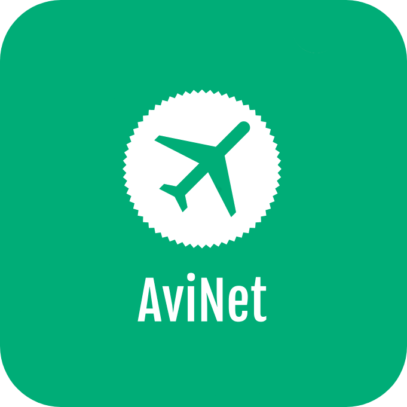

  

  <h1 align="center">AviNet Web 🧑‍✈️✈️🛩️🚁</h1>

This project is the front-end of a social network and online log record for
pilots. Think Strava for people that love flying!

The front-end is a React application built in Typescript.

> This project is still in development and should not be relied upon. For
> project backlog, see the Projects tab of the repository.

## Planned AviNet features

See [AviNet API readme.md](https://github.com/frdwhite24/avinet-api/blob/main/README.md) for feature list.
